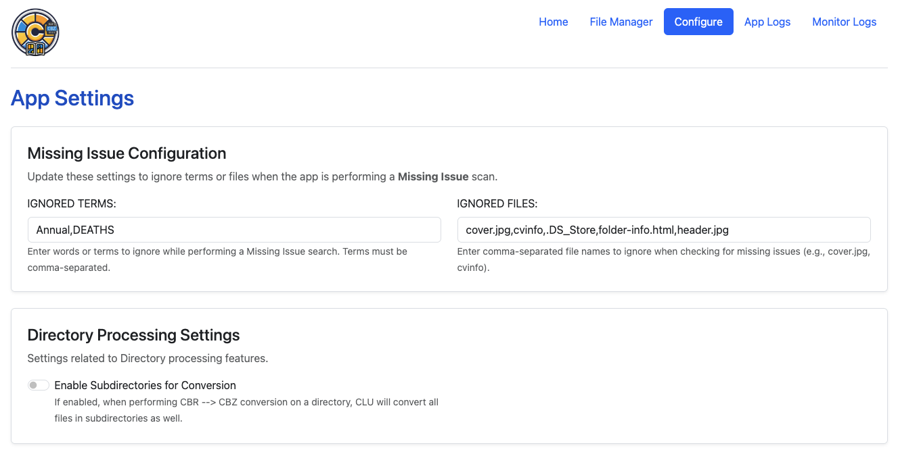

# App Settings

Once installed, all other app options can be updated on the App Settings page.

<figure><figcaption>
Part of the App Settings page
</figcaption></figure>

The app will be installed with a default config and once that is initialized, any changes made by the user will persist during updates.
