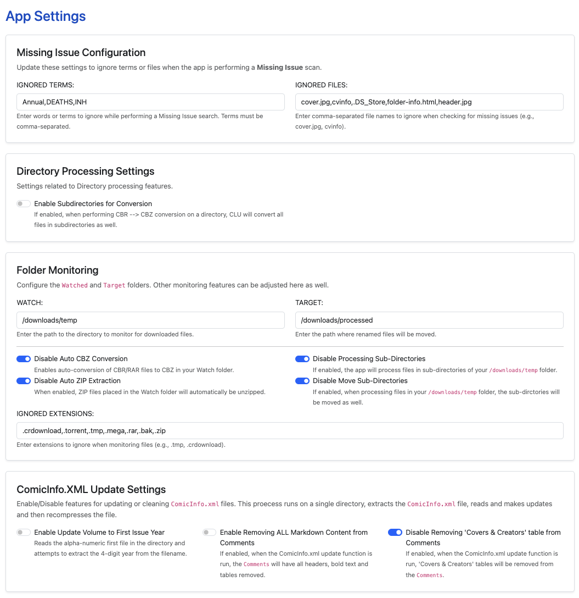

# Settings Available

With the exception on enabling [folder-monitoring](../folder-monitoring/ "mention"), all options can be updated in the Settings page.

<figure><figcaption>
Settings Menu
</figcaption></figure>

### Missing Issue Configuration

The two options here will vary greatly on how much you use [markdown-3.md](../directory-features/markdown-3.md "mention") and how your library is structured.

**IGNORED TERMS:** Add a comma-separated list of words/tems to ignore while checking for missing issues. Update these terms and re-run the missing issue check to better parse your library.

**IGNORED FILES:** Add a comma-separated list of files to ignore when checking for missing issues. Your collection may be a mix of CBZ/CBR/PDF or other files but if you have other files in your directories you want excluded, just add them here.

### Directory Processing Settings

**Enable Subdirectories for Conversion:** This specifically allows [markdown.md](../directory-features/markdown.md "mention")to traverse subdirectories and convert all CBR/RAR files to CBZ. This is not enabled by default - as running this on a high level folder AND a large collection could take quite a bit of time.

### Folder Monitoring

This is the most extensive set of features and will only be applicable if [folder-monitoring](../folder-monitoring/ "mention") is enabled. Most of these feature flags enhance the previous feature flag.

**WATCH:** The folder that will be monitored for files being added. This setting is dependent on the optional location mapped during [quickstart.md](../../getting-started/quickstart.md "mention")guide.

**TARGET:** The folder where files will be after they are processed. This setting is dependent on the optional location mapped during [quickstart.md](../../getting-started/quickstart.md "mention")guide.

**IGNORED EXTENSIONS:** File types listed here will be ignored by the file monitoring process. Many of these file types are `temp`file types and should be ignore. However, if you want to have others files in the WATCH folder and not have them processed with your enabled options - add those extenison types here.

**Auto CBZ Conversion:** If enabled, when CBR files are downloaded, this will auto-convert them to CBZ

**Auto ZIP Extraction:** If enabled, when ZIP files are added to your WATCH folder, this will automatically extract them. This does not create folders. It uses the structure within the ZIP file.&#x20;

For ZIP only, this specifically bypasses the IGNORED EXTENSIONS.

**Processing Sub-Directories:** If enabled, this will perform monitoring functions on sub-directories within your WATCH folder. For example, if you have `/WATCH/archive01.zip` and it is auto-extracted to `/WATCH/archive`each file will be processed and moved to `/TARGET`.

**Moving Sub-Directories:** If enabled, this will preserve any sub-directories in your `/WATCH` folder when they are moved to your `TARGET` folder. For example, if you have `/WATCH/archive01.zip` and it is auto-extracted to `/WATCH/archive`each file will be processed and moved to `/TARGET/archive`.


To Do: Hide these in settings if folder monitoring is not enabled or inform user that folder monitoring is not enabled.


### ComicInfo.XML Updates

All of these features related to updating/cleaning the `ComicInfo.xml` file in archives. I would consider these experimental or beta features - in that they have been tested the least.

**Update Volume to First Issue Year:** If there is not a **volume year** in the `ComicInfo.xml` this will read the (YEAR) from the first issue in the folder and update the **volume year** for each file to match.

**Remove All Markdown Content:** When enabled, if there are _tables_, _bold text_, or _headers_ in the Comments field of the `ComicInfo.xml` file, they will be removed.

**Remove 'Covers & Creators' Table:** When enabled, if there is a _Covers & Creators table_ in the Comments field of the `ComicInfo.xml` file, it will be removed.

### Save & Restart

**SAVE:** Click the Save button to save any changes you have made to the app.

**RESTART APP:** Only require on the initial install and a quick way to force restart to reload the config/settings changes.
