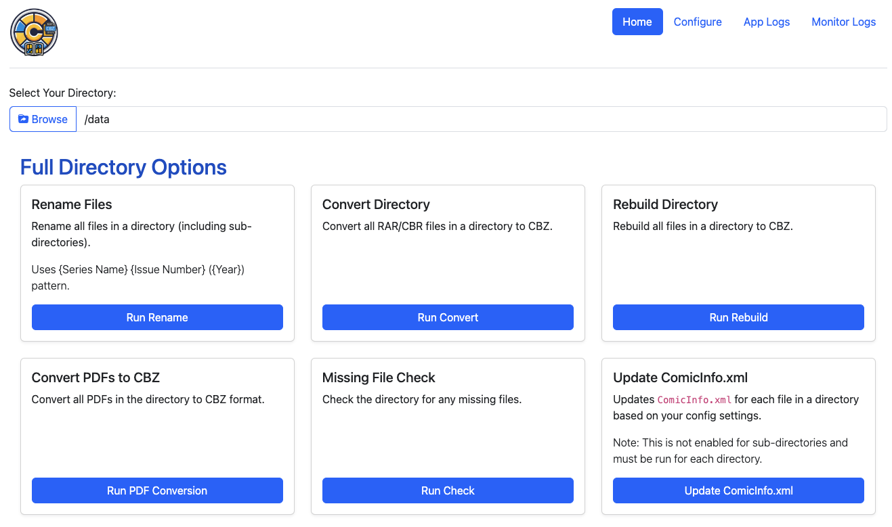

# Directory Features

<figure><figcaption></figcaption></figure>

Directory based functionality is the reason I started building the app and makes up the foundation of what CLU can do.&#x20;

When browsing your library or entering a path, CLU will display Directory Features if it detects a directory in path field.

Keep reading for a breakdown of the features
