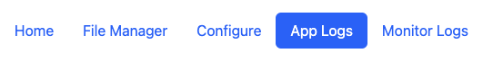
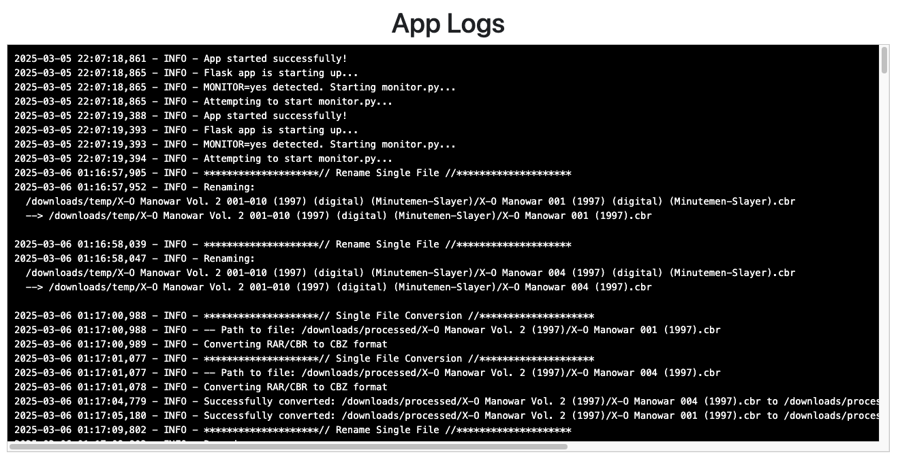

# App Logs

<figure><figcaption>
Navigate to App Logs
</figcaption></figure>

Navigating to App Logs will let you view log messages related to all app functions (Single File & Directory).&#x20;

<figure><figcaption>
Example App Log
</figcaption></figure>

In the example above, we can see a few things:

* **App Status:** Startup up message and [folder-monitoring](../folder-monitoring/ "mention")enabled (yes/no)
* **Rename File: R**enaming to / from messaging
* **Single File Conversion:** Details of the file being converted and it's location
* **Error Messages:** While there are none displayed, error messages will show here as well
