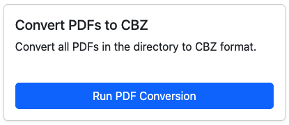

# Convert PDF to CBZ

<figure><figcaption>
Convert PDF to CBZ
</figcaption></figure>

Converts all PDF files in a directory to CBZ files

This seems to be an edge case, but I had several comic magazines in PDF format. With the art and full-color pages, I wanted them available as CBZ for reading on my iPad.

_Note:_ I've only tested this on a few edge cases. If you see an issue using this, please [create an Issue here](https://github.com/allaboutduncan/comic-utils/issues).
