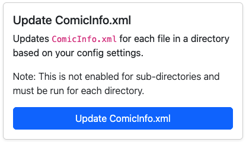

# Clean ComicInfo.xml

<figure><figcaption>
Clean ComicInfo.xml
</figcaption></figure>

Requested by a user on Discord, this feature will let you bulk update specific items in the `ComicInfo.xml` of each _CBZ_ file in a directory.&#x20;

Currently it supports two fields and will only work on the selected directory (no traversing sub-directories).&#x20;

Both options need to be enabled in the [CONFIG](../../getting-started/publish-your-docs-1.md) section of the app.

1. **Update Volume:** This will update `Volume` all files in the selected directory using the (YEAR) obtained from the first file in the directory. If a 4-digit YEAR in parentheses is not available, no updates will be made.
2. **Clean Comments:** This feature will REMOVE content from the `Comments` field each file of the selected sub-directory. There are two options available for cleaning comments.
   1. Remove any content that starts with `*List` until the next paragraph/blank line. This specifically targets _List of covers and their creators:_ and the table data that follows
   2. Remove all content that is `## Header`, **Bold** or in a `| Table |`

### To Do: Add Examples
