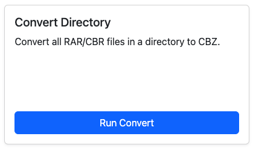

# Convert Directory

<figure><figcaption></figcaption></figure>

Converts all _CBR / RAR_ files in a **directory** to ZIP/CBZ.&#x20;

This process skips any existing CBZ files.

If you need to rebuild a directory to fix corrupted files as well, use [markdown-1.md](markdown-1.md "mention").

### Converting Sub-Directories

By default, this feature will only convert the directory selected and will not convert any sub-directories.

In [app-settings](../app-settings/ "mention"), you may "_Enable Subdirectories for Conversion_" which will allow this feature to traverse sub-directories as well.


Be aware, running this on a high level directory could run for a good bit of time.

In testing, I was able to convert 98 files (between 50MB to 300MB each) in \~20 minutes.


