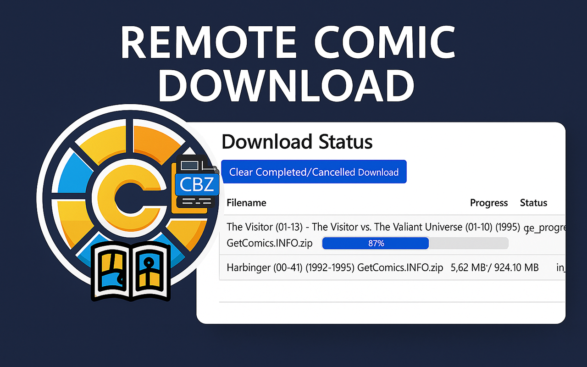

# Chrome Extension

<figure><figcaption></figcaption></figure>

Once you have the [Chrome extension installed](https://chromewebstore.google.com/detail/send-link-to-clu/cpickljbofjhmhkphgdmiagkdfijlkkg), you will need to configure the options.&#x20;

You'll see a screen similar to this within Chrome.

<figure><figcaption></figcaption></figure>

### API URL

Visiting https://localhost/download will show you a confirmation that your API url is running and ready to accept requests.

In order to accept requests from machines other than the one running CLU, you will need to have a tunnel, domain, VPN or other means of access setup.

Personally, I use Cloudflare tunnels and to accommodate authenticating that way, you can pass custom content in the header with the download request.

### Custom Headers

This setting allows you to pass custom auth variables or anything else in the header. Simplay enter the content you need to pass as JSON. The example provided shows you how to pass Client ID and Client Secret to authenticate to your site.

```json
{
    "CF-Access-Client-Id":"you-client-id",
    "CF-Access-Client-Secret":"your-secret"
}
```

You'll need to add these same settings in the [API Download Configuration](../app-settings/integrations-1.md#directory-and-file-processing-settings). This ensures your validation credentials get passed by Chrome and the CLU app.

Once you have everything configured, you can test it out.
