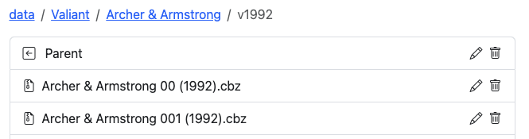
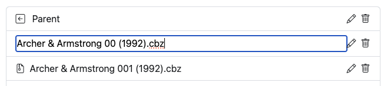
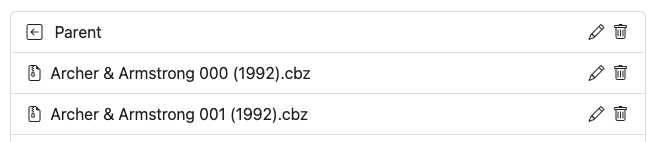

# Rename

### Rename Single Files

<figure><figcaption>
Folder Layout
</figcaption></figure>

Navigate to the directory or file you'd like to rename and click the :pencil2: icon. This will change to an input, allowing you to rename the folder or file.

`ENTER` to save/update the name

<figure><figcaption>
Renaming the file
</figcaption></figure>

<figure><figcaption>
File is renamed
</figcaption></figure>

### Rename All Files in a Directory

In all directory listings, you'll see a blue icon button that will "Rename All Files" in that directory using your custom renaming logic or the default logic.

<figure><figcaption></figcaption></figure>

Clicking this will run the same renaming functions detailed on [editor.md](../directory-features/editor.md "mention"). This let's you easily run this feature as you are browsing your folders of if you manually add bulk issues or don't use the [folder-monitoring](../folder-monitoring/ "mention") features.

### Remove Text from Files

You can now remove characters from groups of files while browsing a directory. If there are files present, you will see a "Remove Text from Filenames" button. Clicking this will bring up a modal and prompt for the characters to remove. Include any spaces you want removed as well.

<figure><figcaption></figcaption></figure>

In this example, I want to update all files and remove the " V2" from the titles.

<figure><figcaption></figcaption></figure>

Click preview once you have your text entered and the app will show a preview of the results. If the naming is as you would like, click the "Execute Rename" and the app will update all of the files, provide a summary and then close the modal.

### Replace Text in Filenames

You can also replace text in all filenames in a directory. In this example, the series is "Saga of the Swamp Thing" and I want the naming to be "**The** Saga of the Swamp Thing"

Simply click the "Replace Text" button, enter the text to replace and then the replacement text. Click "Preview" to ensure your results are correct. Once you are satisfied with the results, click "Execute Rename" to process. Once completed, you'll see a summary of files renamed.

<figure><figcaption></figcaption></figure>

text

### Rename Series

You can also rename all files in a directory, replacing everything except the {issue} & {year}. This is useful if a series is named differently or truncated. In this example, all files were named Swamp Thing, but the series didn't switch to that naming until issue 31. We can rename all the files quickly.

<figure><figcaption></figcaption></figure>

Type in the new file naming you want and click preview. You'll see the expected results for the first 3 files. Click "Execute Rename" to proceed or adjust your naming and click "Preview" to review.

<figure><figcaption></figcaption></figure>

After clicking "Execute Rename" you'll see a summary count of all files renamed.
