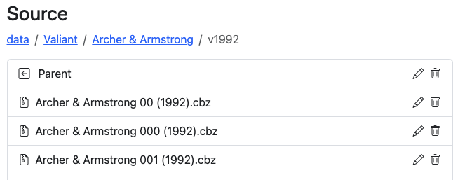
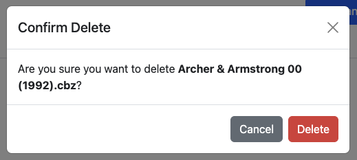
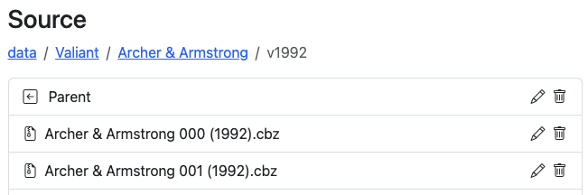

# Delete

### Delete Files

<figure><figcaption>
Delete the first file
</figcaption></figure>

You can see in the example above, we have 2 files that are the same, with slightly different naming conventions. To remove one of the files, simply click the :wastebasket: (Trash) icon and you'll be presented with a confirmation - to ensure you don't accidentally delete an item.

<figure><figcaption>
Confirming Delete Action
</figcaption></figure>

<figure><figcaption></figcaption></figure>

After confirming the delete, the file is removed from the UI and directory.

### Delete Directories

Deleting directories works in the same way - but will remove ALL FILES and the directory itself.

### Delete Multiple Files

You can CTRL+Click or SHIFT+Click to select multiple files. Once you have multiple files selected, the UI will show what options you have.

<figure><figcaption></figcaption></figure>

You can see we have 4 files selected. Right-clicking will show you the option to "Delete Selected Files"

<figure><figcaption></figcaption></figure>

Clicking that option will show you the files that will be deleted and ask you to confirm.

<figure><figcaption></figcaption></figure>

Clicking "Delete All" will delete the files. The modal will close and the files will be removed from the directory and the UI.
