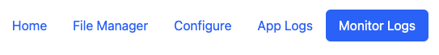
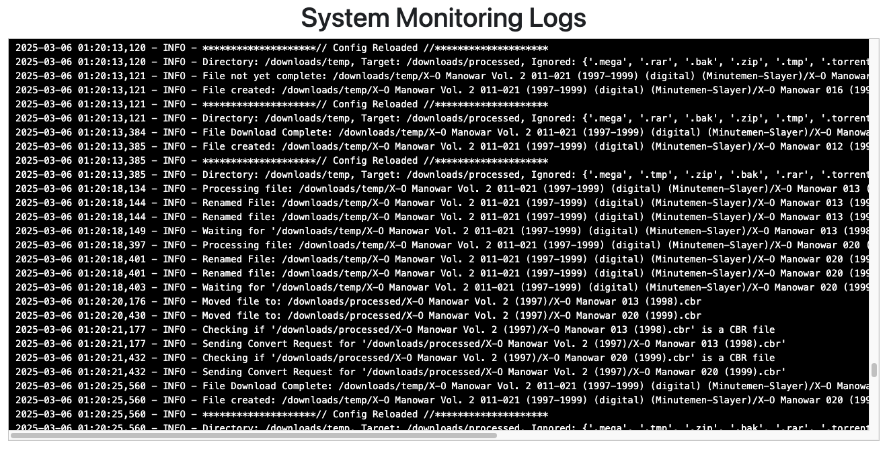

# Monitoring Logs

Once enabled and configured, you'll see a Monitor Logs link in your app navigation.

<figure><figcaption>
Monitor Logs in Navigation
</figcaption></figure>

This will let you view log messages associated specifically with Folder Monitoring. Navigating to this page you should see something like this:

Folder Monitoring uses some of the base functions of the app to perform actions. Logs related to these actions (renaming, conversion, etc) are visible on the App Logs page.

<figure><figcaption>
Folder Monitoring Logs
</figcaption></figure>

In the example above, we can see a few things:

* **Config Reloaded:** Monitoring continually checks for config file changes to ensure it's always running the most recent config.
* **Processing File:** The file currently being processed
* **Waiting For:** App detects file is being updated, so it waits to do other actions
* **Renamed:** The file before:after renaming&#x20;
* **Moved File:** The file location before:after moving
* **Checking If:** Checking if file is a CBR and needs conversion
* **Sending Convert Request:** File being sent for conversion
