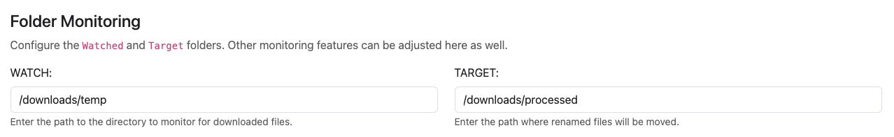

# Monitoring Setup

Folder monitoring is a feature that can be enabled during installation or when updating the container. Once enabled, there are several features available.

### Install or Update

Monitoring runs as a separate process to ensure background operations do not interfere with any manual processing done by the user. In order to support this, folder monitoring must have 2 options configured in the <mark style="color:blue;">`docker-compose.yaml`</mark>


```yaml
version: '3.9' 
services: 
    comic-utils: 
        image: allaboutduncan/comic-utils-web:latest
        container_name: comic-utils

        restart: always
        ports:
            - '5577:5577'
        volumes:
            - '/path/to/local/config:/config' # Maps local folder to container
            ## update the line below to map to your library.
            ## Your library MUST be mapped to '/data' for the app to work
            - 'D:/Comics:/data'
            ## Additional folder if you want to use Folder Monitoring.
            - 'F:/downloads:/temp'
        environment:
            - FLASK_ENV=development
            ## Set to 'yes' if you want to use folder monitoring.
            - MONITOR=yes/no 
```


These options are:

* **Line 8:** Secondary volume/location for monitoring
* **Line 20:** `MONITOR=yes` to enable

If you want to enable monitoring and did not configure these on setup, simply stop the container, update your <mark style="color:blue;">`docker-compose.yaml`</mark> file and restart.

### Setup & Requirements

When you have monitoring enabled, you will need to configure a **WATCH** folder and a **TARGET** folder.

<figure><figcaption></figcaption></figure>

* **WATCH** is the source folder that will be monitored. Files in this location will have automated actions applied to them&#x20;
* **TARGET** is the destination folder where files will be moved as they are processed.

###


