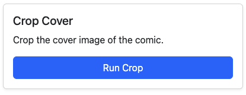

# Crop Cover

<figure><figcaption>
Crop Cover
</figcaption></figure>

Use this tool to crop a cover that is front & back, to front only.

The wraparound cover is not deleted, but re-ordered in the CBZ to be the 2nd image.

|                                     Before                                    |                                     After                                     |
| :---------------------------------------------------------------------------: | :---------------------------------------------------------------------------: |
|  |  |

