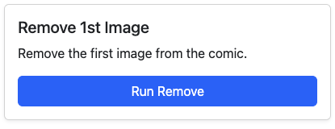

# Remove First Image

<figure><figcaption>
Remove First Image
</figcaption></figure>

Many older files will have a cover image that is not the cover of the comic.

Use this utility to remove the first image in the file.

|                                      Before                                     |                                      After                                      |
| :-----------------------------------------------------------------------------: | :-----------------------------------------------------------------------------: |
|  |  |

