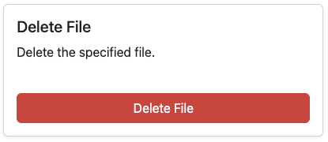
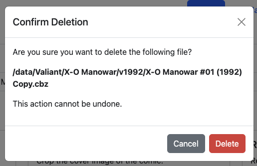

# Delete File

<figure><figcaption>
Delete File
</figcaption></figure>

Utility to delete a single file and requires confirmation before performing the delete action. 

<figure><figcaption>
File Select for Deletion
</figcaption></figure> <figure><figcaption>
Confirming the File Delete
</figcaption></figure>

File deletion can also be performed in the <mark style="color:blue;">**File Manager**</mark> [editor-2.md](../file-management/editor-2.md "mention")
