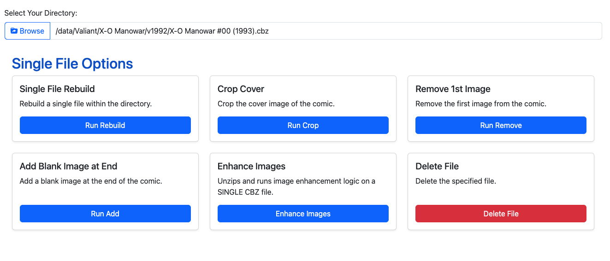
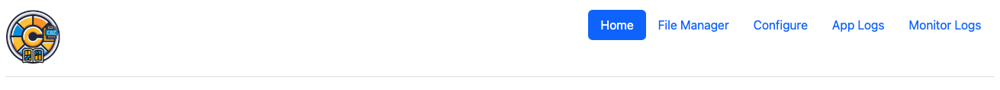

# Configuring the App

&#x20;Once CLU is started, you can access the web interface at: `http://<your-server>:<port>`.

Using the default settings, this should be:

* `http://localhost:5577`
* `http://0.0.0.0:5577`
* `http://127.0.0.0:5577`

### Features

<mark style="color:blue;">**Directory**</mark> or <mark style="color:blue;">**Single-File**</mark> based features are available on the home screen and will change depending on the path entered in the <mark style="color:blue;">Select Your Directory</mark> input

<figure><figcaption>
Directory Options
</figcaption></figure>

<figure><figcaption>
Single File Options
</figcaption></figure>

### Navigation

Navigation in the header will let you access additional features like <mark style="color:blue;">**File Management**</mark>, <mark style="color:blue;">**Configuration**</mark> and <mark style="color:blue;">**Logs**</mark>.

<figure><figcaption></figcaption></figure>

